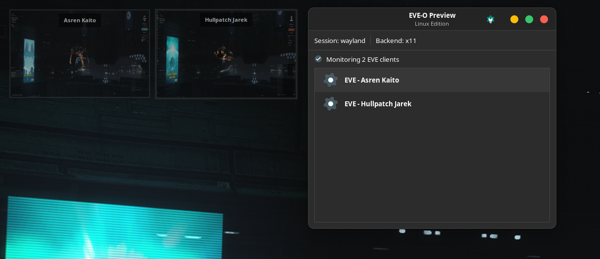
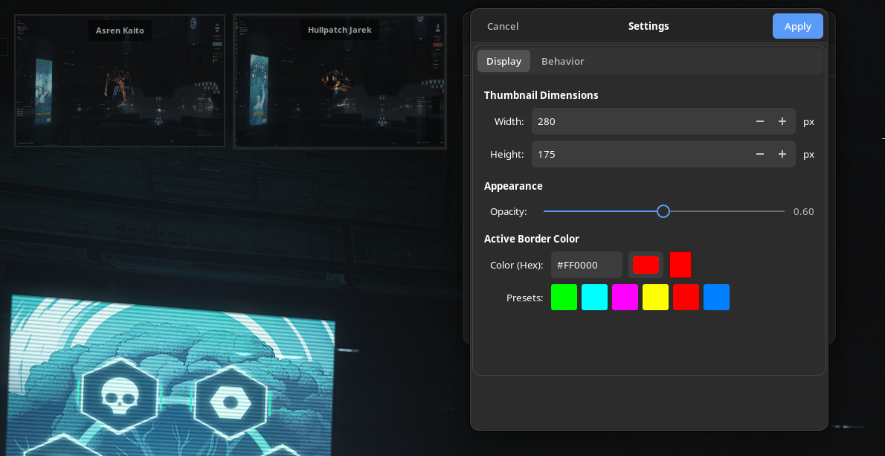
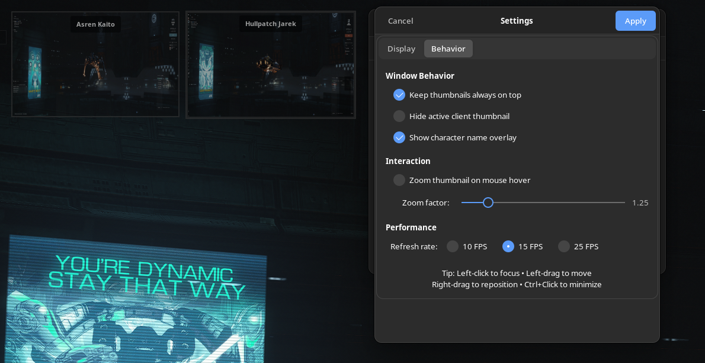
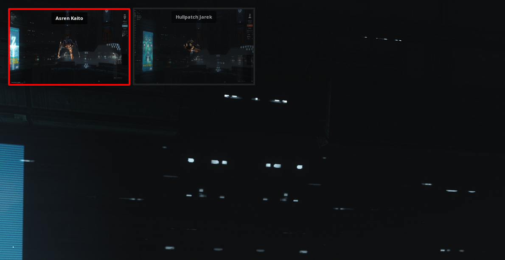
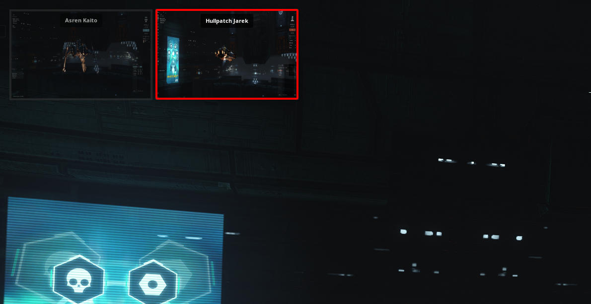

# eve-o-preview-linux

Live thumbnail previews for EVE Online multiboxing on Linux. Click to focus clients, drag to reposition, zoom on hover. Features customizable borders, character overlays, and real-time updates. Works with Steam and native clients on X11. Perfect for managing multiple EVE accounts efficiently.


## ✨ Features

- **Live Thumbnails**: Real-time preview of all EVE Online clients
- **Click to Focus**: Single click to bring any client to focus
- **Drag to Reposition**: Easy thumbnail positioning with mouse
- **Zoom on Hover**: Thumbnails enlarge when mouse hovers over them
- **Active Client Highlighting**: Customizable colored border for active window
- **Character Name Overlay**: Shows character names on thumbnails
- **Steam & Native Support**: Works with both Steam and native EVE clients
- **Persistent Positions**: Remembers thumbnail locations between sessions
- **Customizable Settings**: Adjust size, opacity, refresh rate, and more

## 🖥️ System Requirements

### Required

- **Operating System**: Linux with X11 display server
- **Python**: 3.8 or higher
- **Display Server**: X11 (Wayland not supported - see troubleshooting)
- **Desktop Environment**: Any (GNOME, KDE, XFCE, etc.)

### Tested Configuration

This tool has been developed and tested on:
- **Distribution**: Fedora Linux 42 (Workstation Edition)
- **Kernel**: Linux 6.16.9-200.fc42.x86_64
- **Desktop**: GNOME 48.4 on Wayland (requires X11 fallback - see below)
- **CPU**: AMD Ryzen 7 5800X
- **GPU**: AMD Radeon RX 7900 XTX
- **Memory**: 64GB RAM

## 📸 Screenshots

### Main Control Window
The main window shows all detected EVE clients and displays session type (Wayland/X11) and backend information. Currently monitoring 2 EVE clients.



### Settings Dialog - Display Tab
Customize thumbnail dimensions, opacity, and choose from color presets for the active client border. Supports custom hex colors.



### Settings Dialog - Behavior Tab
Configure window behavior including always-on-top, character name overlay, zoom on hover, and refresh rate options (10/15/25 FPS).



### Click to Switch Between Clients
Simply click any thumbnail to instantly switch focus. Here, Asren Kaito is the active client with the red border.



### Live Thumbnails with Active Client Highlighting
The active EVE client (Hullpatch Jarek) is highlighted with a customizable red border, making it easy to identify which client currently has focus.




### Python Dependencies
```bash
python3-gi
gir1.2-gtk-3.0
gir1.2-wnck-3.0
gir1.2-gdkx11-3.0
📦 Installation
Fedora/RHEL (Tested)
bash# Install system dependencies
sudo dnf install python3 gtk3 libwnck3

# Download the script
wget https://raw.githubusercontent.com/arsin305/eve-o-preview-linux/main/eve_preview_enhanced.py

# Make it executable
chmod +x eve_preview_enhanced.py

# Run it
./eve_preview_enhanced.py
Ubuntu/Debian
bash# Install system dependencies
sudo apt update
sudo apt install python3 python3-gi gir1.2-gtk-3.0 gir1.2-wnck-3.0

# Download and run
wget https://raw.githubusercontent.com/arsin305/eve-o-preview-linux/main/eve_preview_enhanced.py
chmod +x eve_preview_enhanced.py
./eve_preview_enhanced.py
Arch Linux
bash# Install system dependencies
sudo pacman -S python gtk3 libwnck3

# Download and run
wget https://raw.githubusercontent.com/arsin305/eve-o-preview-linux/main/eve_preview_enhanced.py
chmod +x eve_preview_enhanced.py
./eve_preview_enhanced.py
🚀 Usage
Basic Usage

Start your EVE Online clients (Steam or native)
Run the script: ./eve_preview_enhanced.py
Thumbnails will appear automatically for each client

Controls

Left Click: Focus/activate the client
Left Drag: Move thumbnail (drag threshold to prevent accidental moves)
Right Drag: Alternative way to move thumbnail
Ctrl + Left Click: Minimize the client
Mouse Hover: Zoom thumbnail (if enabled)

Settings
Click the settings icon in the main window to customize:

Display: Thumbnail size (100-800px), opacity (0.2-1.0), active border color
Behavior: Always on top, hide active client, show character overlay
Interaction: Zoom on hover (1.1x-2.0x zoom factor)
Performance: Refresh rate (10/15/25 FPS)

⚙️ Configuration
Settings are stored in: ~/.config/eve-o-preview-linux/config.json
You can manually edit this file or use the built-in settings dialog.
Default configuration:
json{
  "thumbnail_width": 320,
  "thumbnail_height": 200,
  "opacity": 0.95,
  "always_on_top": true,
  "hide_active_client": false,
  "zoom_on_hover": true,
  "zoom_factor": 1.25,
  "show_overlay": true,
  "refresh_fps": 10,
  "active_border_color": "#00FF00",
  "thumbnail_positions": {}
}
🐛 Troubleshooting
Running on Wayland (GNOME/Fedora users)
The script requires X11 to function. If you're running Wayland (default on modern Fedora/GNOME):
Option 1: Use X11 session (Recommended)

Log out of GNOME
At the login screen, click the gear icon
Select "GNOME on Xorg"
Log in and run the script

Option 2: Force GDK to use X11 backend
The script automatically sets GDK_BACKEND=x11, but you can also run:
bashGDK_BACKEND=x11 ./eve_preview_enhanced.py
To verify your session type:
bashecho $XDG_SESSION_TYPE
# Should show "x11" for the script to work properly
Thumbnails not appearing

Ensure you're running X11 (not Wayland): echo $XDG_SESSION_TYPE
Verify EVE clients are running (not just the launcher)
Check that window titles start with "EVE - " (character name)

Steam clients not detected

The script looks for "exefile.exe" in process command line
Ensure EVE is running, not just the launcher
Check process list: ps aux | grep exefile

Performance issues

Lower the refresh rate in settings (10 FPS recommended)
Reduce thumbnail size (320x200 is optimal)
Check CPU usage with htop or top
AMD users: Ensure AMDGPU drivers are properly installed

Thumbnails showing black screen

This can happen with some graphics drivers or compositing managers
Try disabling compositing in your DE settings
For AMD GPUs: Ensure Mesa drivers are up to date
Try different refresh rates in settings

SELinux issues (Fedora/RHEL)
If you encounter permission errors:
bash# Check SELinux status
getenforce

# Temporarily set to permissive for testing
sudo setenforce 0

# If this fixes it, create a custom policy or disable for this script

🤝 Contributing
Contributions are welcome! Please feel free to submit a Pull Request. For major changes, please open an issue first to discuss what you would like to change.
Development Setup
bashgit clone https://github.com/arsin305/eve-o-preview-linux.git
cd eve-o-preview-linux
./eve_preview_enhanced.py

📝 Known Issues

Wayland: Not supported due to security restrictions. Use X11 session.
Some DEs: Compositing managers may cause black thumbnails
High DPI: Scaling may need manual adjustment in settings
Multi-monitor: Thumbnails default to primary monitor

🎮 Performance Notes

Recommended Settings

Refresh Rate: 10 FPS (good balance of smoothness and CPU usage)
Thumbnail Size: 320x200 (optimal for most displays)
Opacity: 0.95 (minimal transparency for best performance)

High-end Systems
If you have a powerful system (like the tested configuration with Ryzen 7 5800X and RX 7900 XTX):

You can safely use 15-25 FPS for smoother thumbnails
Larger thumbnail sizes (400x250+) work well
Enable zoom on hover without performance concerns

Lower-end Systems

Use 10 FPS
Smaller thumbnails (280x175)
Disable zoom on hover
Reduce opacity slightly

📜 License
This project is licensed under the MIT License - see the LICENSE file for details.

🙏 Acknowledgments

Inspired by the original EVE-O Preview for Windows
EVE Online™ is a trademark of CCP hf.
This tool is not affiliated with or endorsed by CCP Games

## ⚖️ Legal & Compliance

**Third-Party Tool Disclaimer:**

This is an unofficial, community-created tool and is **not affiliated with, endorsed by, or supported by CCP Games**. EVE Online™ is a registered trademark of CCP hf.

**Personal Project:**

This tool was originally developed as a personal project for my own use while multiboxing EVE Online on Linux. I'm sharing it with the community in hopes that other Linux players find it useful. As this is a hobby project, updates and support are provided on a best-effort basis.

**User Responsibility:**

By using this tool, you acknowledge that:

- You are responsible for ensuring your use complies with [CCP's EULA](https://community.eveonline.com/support/policies/eve-eula-en/) and [Third-Party Policy](https://support.eveonline.com/hc/en-us/articles/202732751-Third-Party-Applications-and-Other-Software)
- This tool is provided "as-is" without warranty of any kind
- The developers are not responsible for any consequences resulting from the use of this software
- You use this tool at your own risk

**What This Tool Does:**

EVE-O Preview is a passive observation tool that creates visual thumbnails of your EVE Online client windows. It does not:
- Modify game files or memory
- Inject code into the game client
- Automate any gameplay actions
- Provide unfair advantages beyond basic window management
- Send or intercept network traffic

This tool serves the same function as the Windows version of EVE-O Preview, adapted for Linux users.

**Questions or Concerns:**

If you have questions about whether this tool complies with CCP's policies, please consult CCP's official support channels or review their third-party application guidelines.

🔗 Links

EVE Online
Original EVE-O Preview (Windows)
Report Issues

📞 Support
If you encounter issues:

Check the troubleshooting section above
Search existing GitHub Issues
Create a new issue with:

Your Linux distribution and version

Output of echo $XDG_SESSION_TYPE
Any error messages from the terminal
Screenshot if applicable
