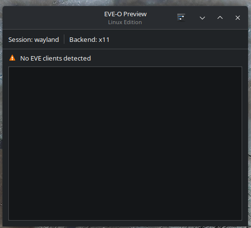
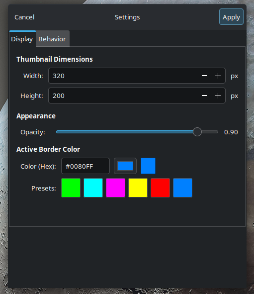
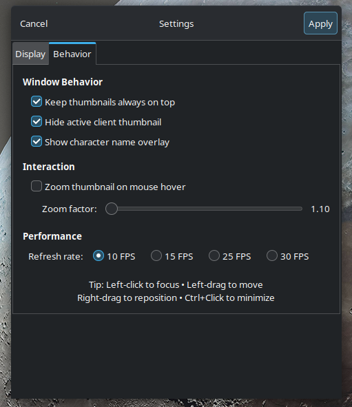

# EVE-O Preview for Linux

**Live thumbnail previews for multiboxing EVE Online on Linux.**
Click to focus clients, drag to reposition, and zoom on hover.
Features customizable borders, character overlays, and real time updates.
Built from the ground up in Python/GTK3 supports X11 and Wayland via XWayland.


> Inspired by [EVE O Preview for Windows](https://github.com/Phrynohyas/eve-o-preview) not a port, but an independent implementation for Linux.

---

## Features

- **Live Thumbnails:** Real time preview of all running EVE Online clients
- **Click to Focus:** Left click any thumbnail to instantly switch to that client
- **Drag to Reposition:** Left drag or right drag to move thumbnails anywhere on screen
- **Ctrl+Click to Minimize:** Quickly minimize a client without alt tabbing
- **Zoom on Hover:** Thumbnails enlarge when moused over (configurable zoom factor)
- **Active Client Highlighting:** Configurable colored border shows which client has focus
- **Character Name Overlay:** Displays character name on each thumbnail
- **Hide Active Client:** Optionally hide the thumbnail for the currently focused client
- **Adjustable FPS:** 10, 15, 25, or 30 FPS to balance smoothness vs. CPU usage
- **Persistent Positions:** Thumbnail positions saved and restored between sessions
- **Wayland Support:** Auto detects Wayland and uses XWayland backend; optional gtk-layer-shell for proper overlay support above fullscreen EVE windows
- **MultiClient Stability:** GLib priority scheduling keeps UI responsive with 2+ EVE clients

---

## Support
If you enjoy my work, feel free to buy me a coffee!

[](https://ko-fi.com/U7U31XQGE8)

## Demo

[](https://www.youtube.com/watch?v=WN8BS4XNsOU)

> ! image generated by AI !
> 60-second walkthrough: launch, detect clients, click-to-focus, drag thumbnails, and settings.

---

## Screenshots

| Description | Image |
|---|---|
| **Dual Client Active Border** Colored border highlights which client has focus. |  |
| **Dual Client Management Window** Lists detected EVE clients with live thumbnails. |  |
| **Single Client** Monitoring one EVE client with thumbnail overlay. |  |
| **Management Window** Shows session type (Wayland/X11) and backend info. |  |
| **Settings Display** Adjust thumbnail size, opacity, and active border color. |  |
| **Settings Behavior** Configure always on top, overlays, zoom, and refresh rate. |  |

---

## System Requirements

### Required

- **OS:** Linux
- **Python:** 3.8+
- **Display Server:** X11 or Wayland with XWayland
- **GTK 3** and **libwnck 3**
- **GdkX11** (included with GTK3 X11 backend)

### Optional

- **gtk-layer-shell** — enables overlay thumbnails above fullscreen EVE clients on Wayland compositors
- **wmctrl** — used as a fallback focus activation strategy
- **xdotool** — additional fallback for XWayland window activation

### Tested On

- Fedora 43 KDE Plasma 6 (Wayland) with XWayland
- EVE Online via Steam (Proton/Wine XWayland)

---

## Installation

### Fedora / RHEL

```bash
sudo dnf install python3 python3-gobject gtk3 libwnck3

# Optional — improves click-to-focus reliability:
sudo dnf install wmctrl xdotool

# Optional — Wayland overlay support (recommended on KDE Plasma / GNOME Wayland):
sudo dnf install gtk-layer-shell
```

### Ubuntu / Debian

```bash
sudo apt install python3 python3-gi gir1.2-gtk-3.0 gir1.2-wnck-3.0

# Optional — improves click-to-focus reliability:
sudo apt install wmctrl xdotool

# Optional — Wayland overlay support:
sudo apt install gir1.2-gtk-layer-shell-0
```

### Arch Linux

```bash
sudo pacman -S python gtk3 libwnck3

# Optional:
sudo pacman -S wmctrl xdotool gtk-layer-shell
```

### Download the Script

```bash
wget https://raw.githubusercontent.com/arsin305/eve-o-preview-linux/main/eve_o_preview_linux.py
chmod +x eve_o_preview_linux.py
```

Or clone the repository:

```bash
git clone https://github.com/arsin305/eve-o-preview-linux.git
cd eve-o-preview-linux
```

---

## Usage

1. Start your EVE Online clients (Steam, Lutris, or standalone Wine)
2. Run the script:
   ```bash
   python3 eve_o_preview_linux.py
   ```

The management window will appear showing session type (X11/Wayland) and backend info. EVE clients are detected automatically — thumbnails appear once a character is loaded and the window title resolves to `EVE - CharacterName`.

### Controls

| Action | Input |
|---|---|
| Focus client | Left-click thumbnail |
| Move thumbnail | Left-drag or right-drag |
| Minimize client | Ctrl + Left-click thumbnail |
| Zoom thumbnail | Hover (if enabled) |

### Debug Mode

```bash
python3 eve_o_preview_linux.py --debug
```

Enables per-frame capture diagnostics in the terminal.

For IPC message tracing (layer-shell subprocess communication):

```bash
EVE_PREVIEW_IPC_DEBUG=1 python3 eve_o_preview_linux.py
```

---

## Configuration

Settings are stored at `~/.config/eve-o-preview-linux/config.json` and can be edited through the Settings dialog in the management window (gear icon in the header bar).

| Setting | Default | Description |
|---|---|---|
| Thumbnail size | 320 × 200 px | Width and height of each thumbnail |
| Opacity | 0.95 | Thumbnail transparency (0.0–1.0) |
| Always on top | On | Keep thumbnails above other windows |
| Hide active client | Off | Hide the thumbnail for the focused EVE client |
| Character name overlay | On | Show character name on each thumbnail |
| Zoom on hover | On | Enlarge thumbnail when mouse hovers over it |
| Zoom factor | 1.25× | How much to enlarge on hover (1.1–2.0) |
| Refresh rate | 10 FPS | Thumbnail update frequency |
| Active border color | #00FF00 | Border color for the active client's thumbnail |

Example `config.json`:

```json
{
  "thumbnail_width": 320,
  "thumbnail_height": 200,
  "opacity": 0.95,
  "always_on_top": true,
  "hide_active_client": false,
  "zoom_on_hover": true,
  "zoom_factor": 1.25,
  "show_overlay": true,
  "refresh_fps": 10,
  "active_border_color": "#00FF00",
  "thumbnail_positions": {}
}
```

---

## How It Works

EVE Online on Linux runs through Wine/Proton, which creates XWayland windows. The script uses `libwnck` to discover EVE client windows by matching process command lines against `exefile.exe`, `eve.exe`, and `steam_app_8500`. It captures window content via `GdkX11.gdk_pixbuf_get_from_window()` and renders scaled thumbnails as always-on-top GTK windows.

**On Wayland with gtk-layer-shell installed**, each thumbnail is rendered by a separate subprocess running with `GDK_BACKEND=wayland`. These subprocesses create layer-shell OVERLAY surfaces — guaranteed by the Wayland compositor to appear above all other windows, including fullscreen EVE clients. The main process captures frames via GdkX11 and sends them to each subprocess over stdin/stdout pipes.

**On X11**, thumbnails are regular GTK windows with `keep-above` hints.

**Click-to-focus** uses a multi-strategy approach: direct Xlib calls (`_NET_ACTIVE_WINDOW`, `XSetInputFocus`, `WM_TAKE_FOCUS`) that bypass WM focus-stealing prevention, with `wmctrl` and `xdotool` as fallbacks when available.

**Multi-client stability** is achieved through GLib source priorities:

- Capture timers run at `PRIORITY_LOW` (300) — frame updates yield to everything else
- IPC callbacks (click, hover, drag) run at `PRIORITY_HIGH` (-100) — always processed first
- GTK input events run at `PRIORITY_DEFAULT` (0) — management window stays responsive

---

## Troubleshooting

### Wayland Sessions

The app works on Wayland automatically it forces `GDK_BACKEND=x11` for the main process and uses XWayland for window capture. No manual session switching required.

For best results on Wayland, install **gtk-layer-shell** (see Installation). Without it, thumbnails may appear behind fullscreen EVE clients.

```bash
echo $XDG_SESSION_TYPE  # "wayland" or "x11" — both work
```

### Common Issues

**Thumbnails not appearing**
- Ensure EVE clients are running: `ps aux | grep exefile`
- Clients need to be past the login screen — detection happens once the window title resolves to `EVE - CharacterName`

**Click-to-focus not working**
- Install `wmctrl` and `xdotool` for additional activation strategies
- Check terminal output for `[click]` log messages showing which strategy succeeds

**Thumbnails behind fullscreen EVE on Wayland**
- Install `gtk-layer-shell` — this is required for thumbnails to render above fullscreen XWayland surfaces on Wayland compositors

**Black thumbnails**
- Ensure Mesa/GPU drivers are up to date
- Try lower FPS (10 FPS recommended)

---

## Performance Tips

| Clients | Recommended FPS | Thumbnail Size | Notes |
|---|---|---|---|
| 1–2 | 10–15 FPS | 320 × 200 | Smooth with low overhead |
| 3–4 | 10 FPS | 280 × 175 | Reduce size to keep main loop responsive |
| 5+ | 10 FPS | 250 × 150 | Consider disabling zoom on hover |

---

## Legal & Compliance

**Third-Party Tool Disclaimer:**
This is an unofficial, community-created tool and is **not affiliated with, endorsed by, or supported by CCP Games**.
EVE Online™ is a registered trademark of CCP hf.

**What This Tool Does:**
EVE O Preview for Linux is a passive observation tool that creates visual thumbnails of EVE Online client windows. It does *not*:
- Modify game files or memory
- Inject code into the client
- Automate gameplay
- Send or intercept network traffic

**User Responsibility:**
By using this tool, you acknowledge that:
- You are responsible for ensuring compliance with [CCP's EULA](https://community.eveonline.com/support/policies/eve-eula-en/) and [Third Party Policy](https://support.eveonline.com/hc/en-us/articles/202732751-Third-Party-Applications-and-Other-Software)
- Provided "as-is" without warranty
- Developer(s) are not liable for any consequences from use

---

## Contributing

Pull requests welcome! For major changes, please [open an issue](https://github.com/arsin305/eve-o-preview-linux/issues) first.

```bash
git clone https://github.com/arsin305/eve-o-preview-linux.git
cd eve-o-preview-linux
python3 eve_o_preview_linux.py
```

---

## Links

- [EVE Online](https://www.eveonline.com/)
- [EVE-O Preview for Windows](https://github.com/Phrynohyas/eve-o-preview)
- [Report Issues](https://github.com/arsin305/eve-o-preview-linux/issues)

---

## Support

If you encounter issues:
1. Review the troubleshooting section above
2. Check open [GitHub issues](https://github.com/arsin305/eve-o-preview-linux/issues)
3. Include when reporting:
   - Linux distro and version
   - Desktop environment and session type (`echo $XDG_SESSION_TYPE`)
   - Terminal output from the script
   - Screenshot if applicable

---

## License

Licensed under the **MIT License** see [LICENSE](LICENSE).
